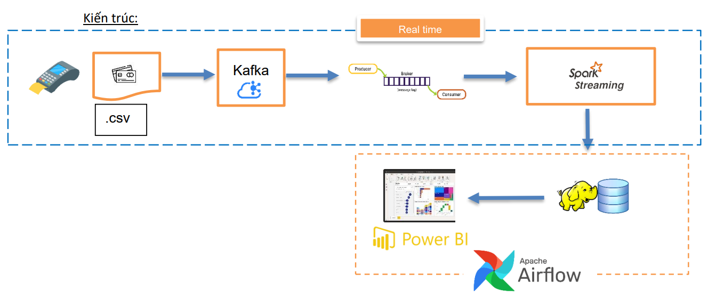

# Đồ án môn Xử lý và phân tích dữ liệu trực tuyến - HCMUS

## Giới thiệu

Đây là đồ án môn học với mục tiêu xây dựng hệ thống quản lý và xử lý dữ liệu giao dịch thẻ tín dụng theo thời gian thực, dựa trên các công nghệ như Kafka, Spark Streaming, Hadoop, Power BI, và Airflow.

## Mô tả bài toán

Một công ty tài chính muốn xây dựng hệ thống quản lý dữ liệu giao dịch thẻ tín dụng. Các giao dịch này được phát sinh từ các máy POS tại các cửa hàng, nhà hàng, và các địa điểm khác. Mỗi giao dịch này được gửi qua hệ thống kafka theo thời gian thực. Sinh viên dùng Kafka để mô phỏng từng giao dịch được phát sinh với các thông tin được cho trước dạng csv. 

Cấu trúc thông tin như sau: `User,Card,Year,Month,Day,Time,Amount,Use Chip,Merchant Name,Merchant City,Merchant State,Zip,MCC,Errors?,Is Fraud?`

Kafka sẽ đọc từng dòng csv và gửi qua topic được định nghĩa trước để giả lập một giao dịch được phát sinh từ máy POS.

## Chức năng

* Xử lý dữ liệu giao dịch theo thời gian thực.
* Kiểm tra lỗi và xác định các giao dịch gian lận (Fraud).
* Lưu trữ thông tin giao dịch thành công vào cơ sở dữ liệu.
* Thống kê số lượng và giá trị giao dịch theo ngày, tháng, năm và trực quan hóa dữ liệu.

## Kiến trúc

1. Sử dụng kafka để đọc dữ liệu csv từng dòng và gửi thông tin này đến topic định nghĩa
trước theo chu kì thời gian ngẫu nhiên trong phạm vi từ 1s đến 3s.
2. Sử dụng spark streaming để đọc dữ liệu từ kafka theo thời gian thực, nghĩa là bất cứ
thông tin nào từ kafka được xử lý tức thì, các xử lý bao gồm lọc dữ liệu, biến đổi thông
tin, tính toán dữ liệu.
3. Sử dụng Hadoop để lưu trữ các thông tin được xử lý từ Spark và là nơi lưu trữ thông tin
được xử lý để có thể trực quan hóa dữ liệu và thống kê ở giai đoạn sau.
4. Sử dụng Power B I để đọc dữ liệu từ Hadoop (dạng csv), thống kê dữ liệu theo mô tả bài
toán và hiển thị dữ liệu một cách trực quan.
5. Sử dụng Air Flow để lên lịch quá trình đọc và hiển thị dữ liệu từ Power PI sao cho dữ liệu
luôn được update mỗi ngày.

